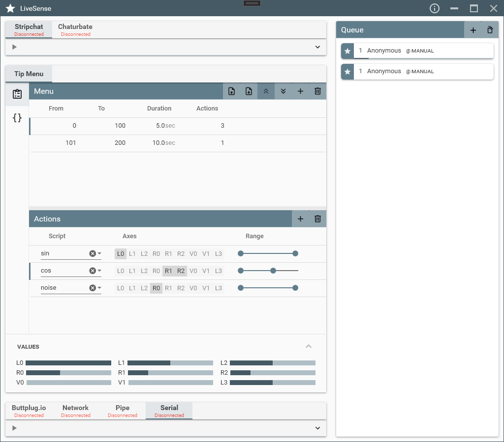
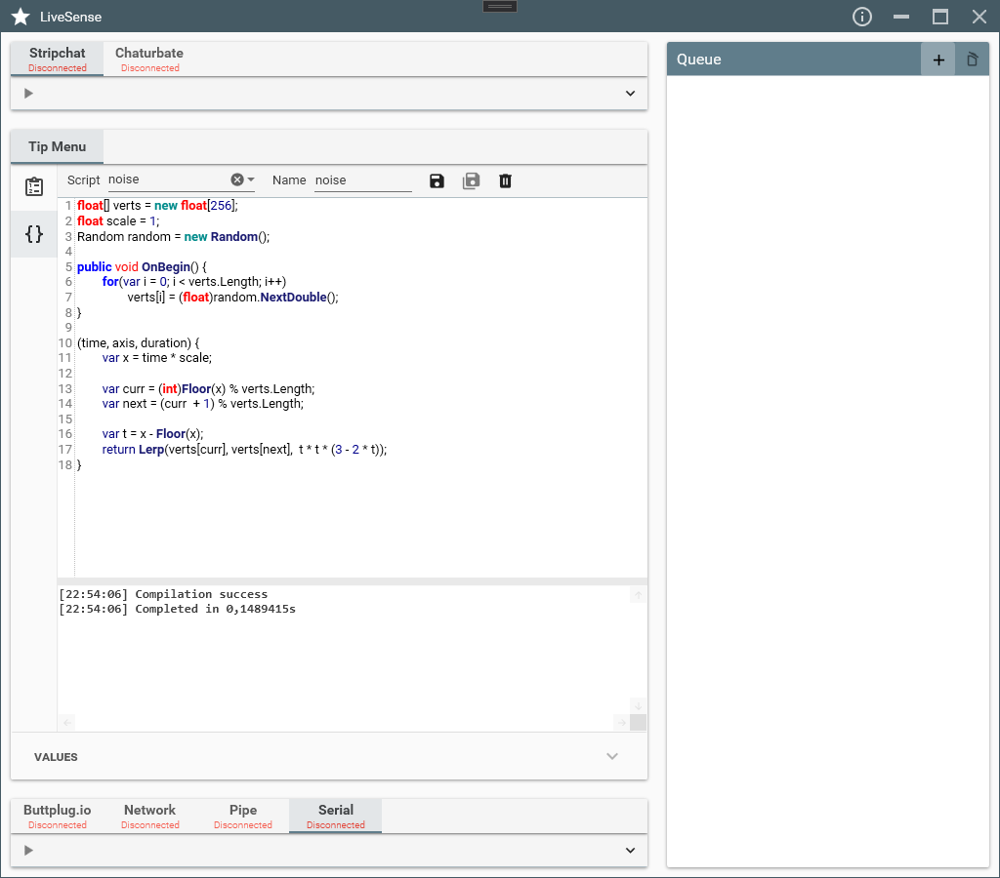

    <h1>LiveSense</h1>
     
    
    

 

# About

LiveSense is a simple app to synchronize your devices (e.g. [OSR](https://www.patreon.com/tempestvr) or [buttplug.io](https://buttplug.io) supported devices) with adult webcam show tips. Supported sites are Chaturbate and Stripchat. 

# Features

* Supports Chaturbate and Stripchat rooms with per room delay
* Ability to output to [buttplug.io](https://buttplug.io), Network TCP/UDP, Namedpipes and Serial
* Supports manually added tips for testing
* Tip Menu based tip handling

# Requirements

* [.NET 5.0 Runtime](https://dotnet.microsoft.com/download/dotnet/current/runtime)